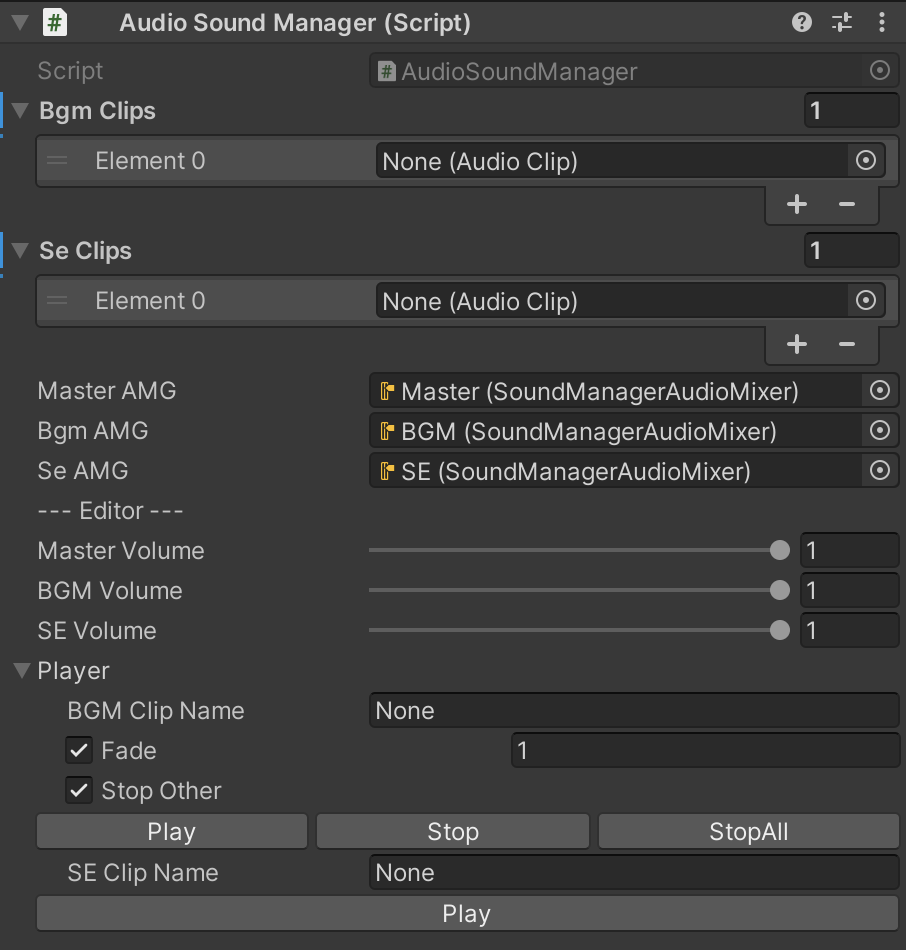

# AudioSoundManager

UnityEngine.Audio を使った汎用サウンドマネージャーです.\
wavファイルを再生させることができます. フェードイン/アウトにも対応しています.

## Requirement
* System
* UnityEngine
* UnityEngine.Audio
* UnityEditor

## Usage
1. unitypackage をインポート.
2. Assets/AudioSoundManager/SoundDirector をSceneに配置.
3. 音声ファイル (.wav) をSoundDirectorにアタッチ.
4. AudioSoundManager.Instance の関数を呼んで音声を再生.

## Inspector

## Static Variable
```cs
AudioSoundManager Instance { get; }
```
## Static Function
```cs
float Vol2Db(float vol) => Mathf.Log10(vol) * 20f
float Db2vol(float db) => Mathf.Pow(10, db / 20f)
```

## Public Function
```cs
AudioSource PlaySE(string clipName)
AudioSource PlayBGM(string clipName, float fadeTime = 0f, bool stopOther = true)
void StopBGM(string clipName, float fadeTime = 0f)
void StopBGM(AudioSource source, float fadeTime = 0f)
void StopAllBGM(float fadeTime = 0f)
void SetMasterVolume(float vol)
void SetBGMVolume(float vol)
void SetSEVolume(float vol)
float GetMasterVolume()
float GetBGMVolume()
float GetSEVolume()
```
## Note
* volの値は 0 ~ 1 です.

## License
"AudioSoundManager" is under [MIT license](https://en.wikipedia.org/wiki/MIT_License).